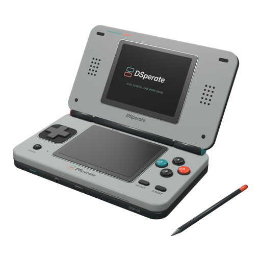

# DSperate-pak


An optional standalone Nintendo DS emulator for Leaf on the Miniloong Pocket 1
(MLP1), packaged for Pak Rat.

[DSperate](https://github.com/beebono/DSperate) is created by
[beebono](https://github.com/beebono). This repository builds and packages their
emulator for Leaf; upstream development and credit belong to that project.

DSperate is added as an alternate core for the existing Nintendo DS system, so
there is no new tile and no app to open. Install this pak and DSperate appears
in the Nintendo DS core picker, where you choose it per system or per game.
DraStic stays the default, and existing DraStic choices keep working. DSperate
keeps its own battery saves and save states, separate from DraStic's.

This repository is a pure content pak. It declares a `type: "path"` core,
carries the compiled DSperate binary and a launch wrapper, and builds from a
clean clone with no sibling checkout.

## Status

[DSperate 2.1.1](https://github.com/Utility-Muffin-Research-Kitchen/DSperate-pak/releases/tag/v2.1.1)
is available for MLP1 through Pak Rat on Leaf 0.12.0 or newer. It updates the
source pin to **DSperate v2.1.1** with five reviewed pak patches, the fifth
being the Leaf RetroAchievements account adapter: on Leaf 0.12.0-beta.6 or
newer, DSperate signs in with the account saved in **Settings > Games >
Accounts**, and an older Leaf leaves DSperate's own sign-in as it was.

Two clean builds and a rebuild from the corresponding-source archive reproduce
the profile-guided binary `87de031c...`, and the pak ZIP and source archive are
byte-for-byte reproducible. The build runs with `DSPERATE_PGO_STRICT` and fails
if a trained object loses its profile or a function no longer matches it.
`--version` reports `v2.1.1 (baec965)`. The account adapter replays the shared
`standalone-ra-account-v1` fixtures and its fault tests on every check.

This exact build passed MLP1 device qualification from 2026-09-24 to
2026-09-26: native sign-in and achievement set loading, a fresh account import
and reuse across both SD cards, a rejected-token retry, account write faults
with the required on-screen error, per-game disable, a retained sign-out, a
changed password picked up on the next launch, controls, audio, suspend, and
about 60 FPS in Contra 4. With DSperate removed, Leaf falls back to DraStic
and keeps DSperate as the saved choice for when you reinstall it.

The published 2.0.0 source pin was DSperate v2.0.0 with three reviewed pak
patches. Two clean builds reproduce its binary, and wrapper, profile, archive
CLI and focused upstream tests passed.
The v2.0.0 binary also passed an MLP1 hardware re-qualification on 2026-09-17:
Jawaka path-core launch and orientation, Menu and controls, old-state loading,
save and save-state faults, running and paused suspend/resume, and sustained
speed and audio. The locked PGO build passed local Pak Rat install, reinstall
and uninstall checks, both core pickers, selection persistence across a device
reboot, the `.7z` warning and stick-driven stylus/tap checks. Uninstall preserved
all 35 tested settings, save and state files byte for byte.
The target is Leaf 0.12.0 with W3/W4 input and Menu support. The pak version
tracks the upstream emulator, so it is now `2.0.0`.
See the [implementation plan](https://github.com/Utility-Muffin-Research-Kitchen/umrk-workspace/blob/main/plans/dsperate-standalone-content-pak.md).

## Build

You need Docker, make, git and python3. Everything else is pinned.

```sh
make standalone     # build the pinned DSperate binary (long; cached)
make test-wrapper   # check the launch wrapper without building
make validate       # check pak.json against the content-pak contract
make check          # validate, run the host tests, package, validate the package
make dist-pakrat    # build/dist/DSperate.mlp1.pak.zip
make dist-source    # GPL corresponding source for the shipped binary
make test-version   # --version from the git build and a rebuild from the source archive
make test-archives  # build both archives twice and compare their bytes
```

`make check` also runs `test-profile` (the MLP1 pad profile), `test-pgo` (the
locked PGO profile and the strict build gate), `test-lock` (manifest, lock and
patches agree), `test-docs` (this README and `PROVENANCE.md` quote the locked
build), `test-ra-account` (the account adapter, below), `test-validate-pak`
(the capability record rule) and `test-archive-cli` (the archive checks
against the real binary, in the pinned AArch64 image).

`make test-ra-account` needs only a host C++ compiler. It takes the adapter's
files out of patch 0005 and replays the `standalone-ra-account-v1` fixtures from
the public leaf-contracts repository, at the commit and sha256 pinned in
`tests/ra-account/contract.lock.json`, through the adapter's own classifier.
It then drives the adapter through interrupted token and marker writes at
every step, a full card, damaged files and a missing account directory.

`make standalone` builds inside the digest-pinned `mlp1-toolchain` image and
refuses an artifact whose sha256 does not match `standalone/upstream.lock.json`.
This candidate builds with a profile retrained for v2.1.1 with the pak's own
GCC 12.3.0 toolchain; see `standalone/PROVENANCE.md`.

Both archives are written inside the same pinned image with sorted entries,
`SOURCE_DATE_EPOCH` timestamps, owner 0 and fixed modes, so anyone rebuilding
gets the same bytes. Publish the corresponding-source archive beside the pak ZIP. It includes the
patched upstream tree in `dsperate-src/`, plus the build scripts, notice-program
source and package files. `make dist-source` checks that the archive contains
the locked build inputs before accepting it.

## Install

Install the pak on the primary card at `Apps/mlp1/DSperate.pak`. It is an
ordinary content pak: the launcher compiles it into the catalog and offers
DSperate in the Nintendo DS core picker.

## RetroAchievements

DSperate runs in casual mode and uses **the account saved in Leaf** (the
launcher's Settings > Games > Accounts). Launch a game from Leaf and the account
is imported automatically: there is no second login screen, and the account is
verified against RetroAchievements the first time. Saving, changing or clearing
it in Leaf takes effect on the next launch, with no reboot and no need to
restart the launcher.

Because Leaf owns the account, the in-game RetroAchievements page says
`MANAGED BY LEAF` and does not offer a manual sign-in. Its **SIGN OUT is
session-only**: it ends achievements for that session, and the next launch
applies Leaf's saved account again. To sign out for good, clear the account in
Leaf's Accounts; after that DSperate receives no credentials either.

To keep achievements off for one game, set `enabled = false` under
`[cheevos]` in that game's INI (or in your global `dsperate.ini` for every
game). That choice wins over the Leaf account: DSperate does not sign in for
that game and leaves the stored account alone.

If the account cannot be used or saved, for example because the card is full,
DSperate tells you in a RetroAchievements pop-up, even when you have turned
achievement notifications off, and keeps playing without achievements. The
next launch tries again; it never falls back to an older account.

DSperate keeps its own sign-in token in
`$USERDATA_PATH/dsperate/retroachievements/`, shared across games and cards;
the account itself is never stored in a save or a state. It saves the token
only after RetroAchievements accepts the account, and only then records that
account as current.

A launch that Leaf does not manage, such as a DSperate build started by hand,
behaves as upstream DSperate: a sign-in from the in-game menu lasts until you
quit.

## Where your data lives

| Data | Location |
| --- | --- |
| Configuration | `$USERDATA_PATH/dsperate/dsperate.ini`, on the primary card |
| Per-game settings | `$USERDATA_PATH/dsperate/games/<game key>/` |
| Battery saves | `$SAVES_PATH/DSperate/<game key>/<ROM stem>.sav`, for the selected card |
| Save states and screenshots | `$STATES_PATH/DSperate/<game key>/`, for the selected card |
| ROM unpack cache | `$USERDATA_PATH/dsperate/cache/<game key>/`, always (never beside the ROM) |
| Firmware settings sidecar | `$USERDATA_PATH/dsperate/games/<game key>/firmware.ovr` |
| RetroAchievements token | `$USERDATA_PATH/dsperate/retroachievements/`, primary card, shared across games |
| Log | `$LOGS_PATH/dsperate.log` |

The game key hashes the logical card slot (`primary` or `secondary_sd`) and
the ROM's path relative to that card's `Roms/NDS`. Same-named ROMs in different
folders or card slots have separate saves, states and settings. Changing a
card's mount path preserves the key.
Renaming or moving a ROM starts a new identity; it does not silently merge
progress.

DSperate's saves are raw SRAM in its own format. They are not DraStic or Fun
DraStic saves, and switching emulators switches saves.

### Archives

DSperate reads `.nds` and `.zip`. A deflated ROM in a `.zip` is unpacked once
into the game's cache directory above; a stored one is read where it lies. The
wrapper pins that directory, so nothing is ever unpacked beside your ROMs, and
it bounds the whole cache before a launch:

- 1 GiB total across every game.
- 512 MiB for one game.
- A free-space check, with a message if the card cannot hold the unpack.

When the cache is full, the least recently used other game's unpack is removed
to make room. The emulator still owns the per-directory cap.

An archive that holds more than one `.nds` is refused rather than guessed at,
and an encrypted, zip64 or otherwise unreadable archive is refused with the
reason on screen. `.7z` is not supported: the launcher passes it through, so
instead of a silent exit the pak shows a message telling you to extract the ROM
or choose another emulator.

### When a launch cannot start

If a ROM cannot be opened, or a required file cannot be created, DSperate shows
a fullscreen message and returns to Leaf instead of exiting silently. The same
message names the reason, which is also written to `dsperate.log`.

### Updating from the v1.15.1 test build

Back up your save states before updating. Upstream v2.0.0 supports reading the
older DS state format, but v1.15.1 cannot load states newly written by v2.0.0.
Battery-save paths and per-game identities stay the same. The pak still targets
DS games; upstream's experimental DSiWare and network features have not been
qualified for Leaf.

### Earlier test installs

The initial test wrapper used shared basename saves, shared game-code states
and `g<cksum>` config folders. Those files are retained. New launches use
`v2-<sha256>` directories, so earlier progress needs a manual, backed-up copy:
launch the intended game once and quit, then copy its old `.sav` into the new
save directory named in `dsperate.log`. Copy only the matching `.dss` states
into that game's state directory. Shared old names cannot identify which game
owned them, so the wrapper does not automatically assign them to a new game.

To keep an earlier layout, copy its old game INI to the matching new game INI
path under `games/<key>/xdg/dsperate/games/`. Remove any `pad.stick_deadzone = 0`
that was written by the old heuristic unless you confirmed calibration for the
selected controller. Launch-bound paths are refreshed on the next launch.

### Default updates

Your global `dsperate.ini` is seeded once and then belongs to you, so a pak
update cannot refresh it wholesale. Instead the package carries a defaults
number (`defaults/config.version`), and a launch migrates a key only while it
still holds the value an earlier package shipped. It never rewrites a value you
changed, and it never touches unrelated lines. A fresh install and a repeat
launch are no-ops. Your global `stick_deadzone`, custom bindings and layouts are
preserved.

## BIOS and firmware

DSperate boots games with a built-in FreeBIOS and a generated firmware, so no
dumps are required. If you place the optional dumps Leaf names under
`BIOS/NDS/` (`nds_bios_arm9.bin`, `nds_bios_arm7.bin`, `nds_firmware.bin`), the
wrapper passes them to DSperate. No BIOS or firmware is bundled here.

## Controls

The MLP1 profile:

- Select is the hotkey modifier. Hold Select and press Start to open
  DSperate's own pause menu, and use it with the other pad buttons for the
  emulator's hotkeys (save state, load state, fast forward, layout, and so on).
- Menu opens DSperate's pause menu. A single Menu tap becomes one Guide press,
  because this pak declares `supports_menu: true`. Menu inside a chord, such as
  Menu plus Volume, still belongs to the launcher.
- Hold Menu for about three seconds to return to Leaf if the emulator stops
  responding. Quit is also in DSperate's pause menu.
- The stick moves the stylus. The MLP1 has one stick, on the left, and no R3,
  so nothing is mapped to the right stick. The d-pad is the d-pad.
- The default stick deadzone is 12000. Once you confirm the selected controller
  receives Jawaka's calibrated output, you can set `[pad] stick_deadzone = 0`
  in your global or per-game INI to avoid applying another deadzone. Your value
  is preserved; a controller roster or calibration file alone does not prove
  which controller DSperate receives.
- R2 taps the screen and L2 is a second tap, for touch games. Hold Select and
  press R2 to fast-forward.
- The face buttons follow the printed labels.

The pause menu is driven with the DS buttons: A confirms, B backs out, and the
d-pad moves.

## Display

Leaf runs under Weston on the MLP1. The wrapper starts DSperate as a single
fullscreen Wayland window and leaves the panel transform to Weston, so the
emulator never rotates the output itself. Correct orientation and input
coordinates are demonstrated on hardware during qualification.

## Known limits

- MLP1 only.
- `.nds` and `.zip` content. `.7z` is not playable; it is refused with an
  on-screen explanation rather than a log-only rejection.
- The v2.0.0 binary passed Wayland dmabuf, orientation, controls, save and
  state faults, suspend/resume and sustained performance on the titles tested.
  Local Pak Rat lifecycle, picker persistence and stylus input checks also pass.
  These results cover the tested titles and input paths, not every DS game.
- The ZIP cache is pinned under your userdata and bounded (1 GiB total, 512 MiB
  per game). Upstream builds without these flags still prefer a cache beside
  the ROM; this pak always passes them.
- Required data paths containing INI comment delimiters (`#` or `;`) are
  refused. ROM filenames may contain those characters. A config-write or
  archive failure stops launch and is shown on screen as well as logged.
- Existing global configs are preserved on updates. Versioned migration handles
  the defaults this package has changed since its first test builds; it does not
  guess at values you set yourself.
- No bundled games, BIOS or firmware.

## Artwork



The packaging art was generated with ChatGPT and supplied by UMRK. It is not an
official DSperate logo. The unchanged originals are archived in `umrk-assets`;
small PNG exports are included here so your build needs no private repository.
See [artwork provenance](pak/art/SOURCE.md).

## Licence

The DSperate binary is GPL-3.0-or-later; this repository's build system and
scripts are MIT. See `LICENSES/README.md`, and run `make dist-source` before
distributing a build.
